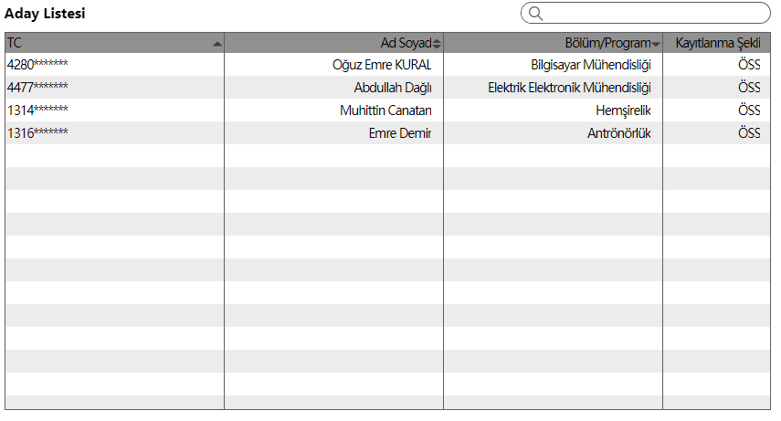
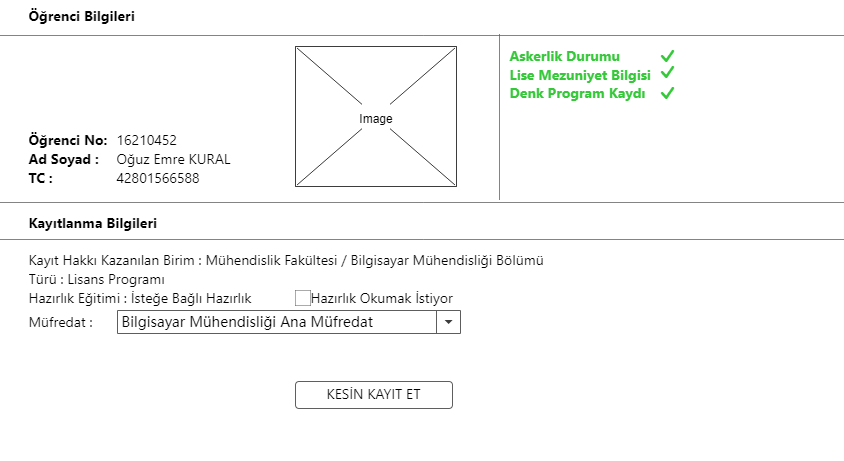
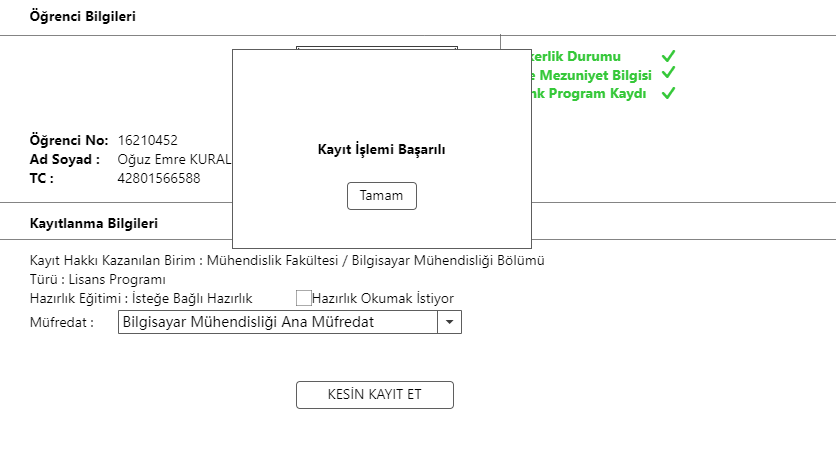
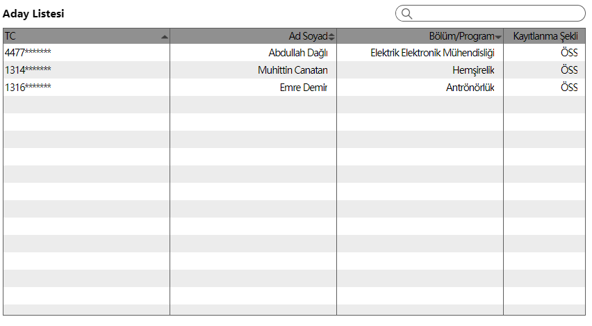
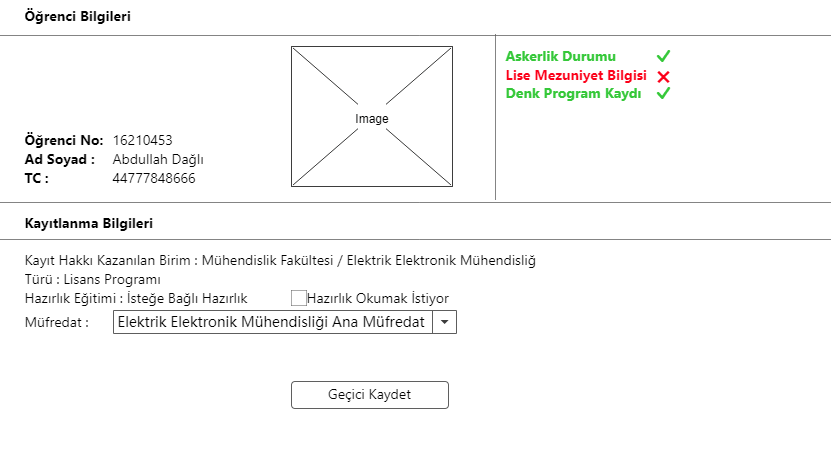
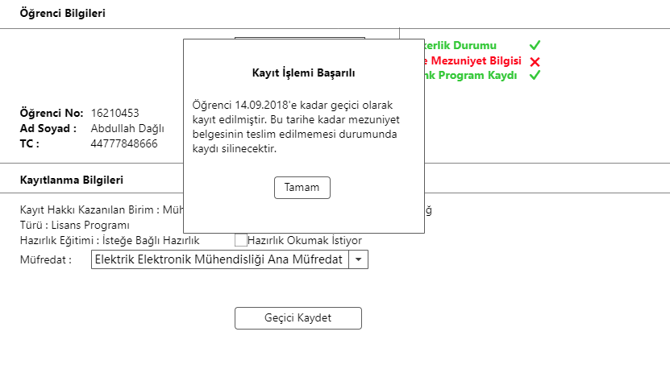
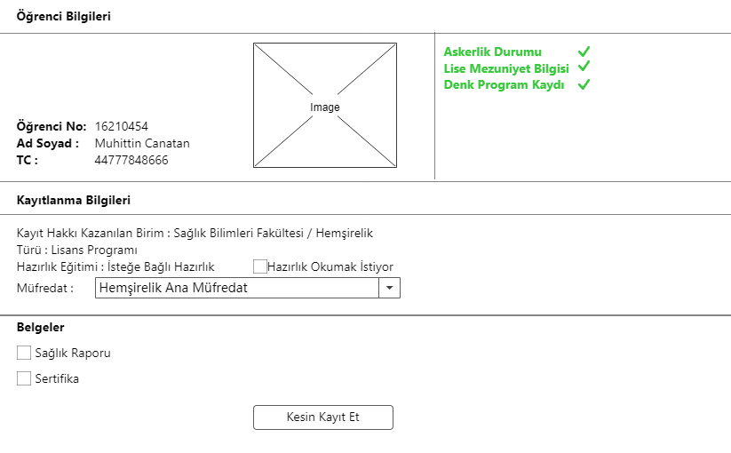
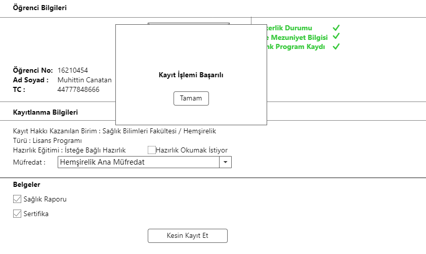
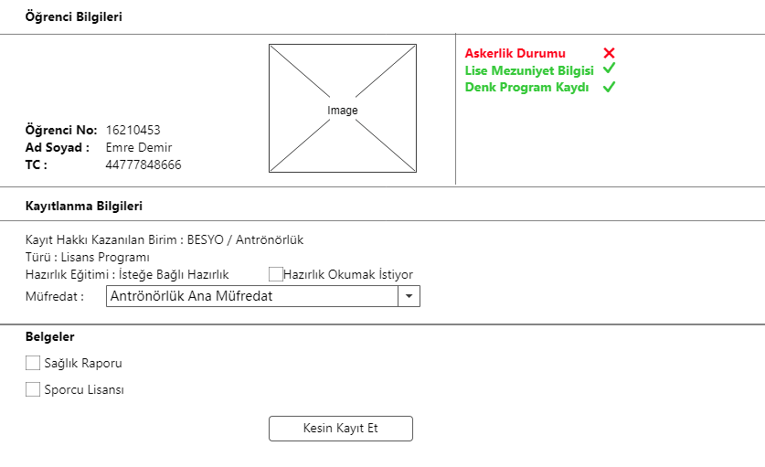
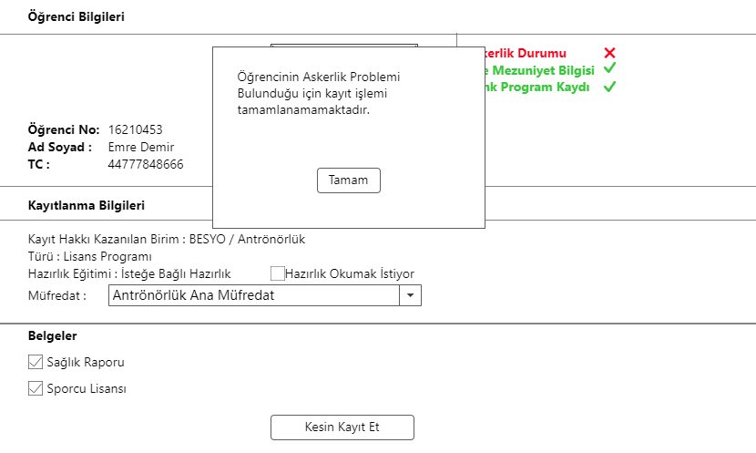

Use Case: ÖSYM sonucuna göre gelen adayları kaydet
============

**Story:** Admin olarak ÖSYM sonucuna göre gelen adayların kesin veya
geçici kayıtlanmalarını gerçekleştirmek istiyorum.

**Actor:** Admin

**Preconditions:**

- YÖKSİS’ten, üniversitemizin herhangi bir lisans/ön lisans programını kazanmış
  lisans/ön lisans programı adayları; yıl bilgileri, aday oldukları program
  bilgileri, ÖSYM sınav bilgileri, askerlik durum bilgileri, MEB mezuniyet
  bilgileri ve denk bir bölümde kayıt durumu bilgileri ile birlikte sistemdeki
  aday listesine aktarılmış olmalı.
- Aday listesindeki her lisans/ön lisans programı adayı için öğrenci numarası
  atanmış olmalı.
- Lisans/ön lisans programı aday listesindeki kayıt olmayı hak eden adayın, aday
  olduğu program için gerekli belgelerin listesi programla ilişkili olarak
  sistemde tanımlanmış olmalı.
- Lisans/ön lisans programlarında müfredatlar tanımlanmış olmalı. Dolayısıyla,
  hazırlık zorunlu olan programlar tanımlanmış olmalı.
- Akademik takvimde, lisans/ön lisans programı adayları için (ÖSS, DGS için ayrı
  ayrı) kesin kayıt, geçici kayıt ve geçici kayıtlanmış öğrencilerin kesin kayıt
  yaptırabilecekleri tarihler belirtilmiş olmalı.

**Postconditions:**

- Lisans/ön lisans programı kayıt işlemi tamamlanmalı.
- Lisans/ön lisans programı adayı için öğrenci kullanıcısı oluşturulmalı.
- Lisans/ön lisans programı adayının sınıfı belirlenmeli.

| Actor        | System       |
| :----------- |:-------------|
| Kullanıcı, lisans/ön lisans adayları listesindeki ilgili adaya tıklar.| Sistem, adayın detay bilgilerini görüntüler.   Sistem, eğer ilgili öğrenci ÖSS ile aday olmuş ve akademik takvime göre henüz ÖSS kayıt süreci başlamamış ise hata mesajı gönderir ve kayıt işlemini tamamlamaz.  Sistem, eğer ilgili aday DGS ile aday olmuş ve akademik takvime göre henüz DGS kayıt süreci başlamamış ise hata mesajı gönderir ve kayıt işlemini tamamlamaz.   Sistem, eğer ilgili aday  ÖSS ile aday olmuş ve akademik takvime göre ÖSS kayıt süreci bitmiş ise hata mesajı gönderir ve kayıt işlemini tamamlamaz.   Sistem, eğer ilgili aday DGS ile aday olmuş ve akademik takvime göre DGS kayıt süreci bitmiş ise hata mesajı gönderir ve kayıt işlemini tamamlamaz.   Sistem, eğer adayın daha önce geçici kaydı yapıldıysa ve geçici kayıtlı öğrenciler için kesin kayıt tarihi geçtiyse, hata mesajı gönderir ve kayıt işlemini tamamlamaz.   Sistem, eğer aday daha önce kayıtlanma sürecini kesin kayıt olarak tamamlamış ise kullanıcıyı uyarır hata mesajı görüntüler ve kayıt işlemini tamamlamaz. Daha önceden yaptığı kayıtlanma detayını görüntüler.   Sistem, eğer aday daha önce kayıtlanma sürecini geçici kayıt olarak tamamlamış ise kullanıcıyı uyarır ve daha önceden yaptığı kayıtlanma detayını görüntüler.   Sistem, eğer adayının askerlik bilgisi olumsuzsa ya da denk bir bölümde kaydı varsa hata mesajı gönderir ve kayıt işlemini tamamlamaz.   Sistem, eğer aday daha önce kayıtlanma yapmadıysa, adayın aday olduğu programın kayıtlanma için şart koştuğu belgeleri, kullanıcının çoklu seçebileceği bir şekilde listeler.   Sistem, kullanıcıdan formu doldurmasını ister: Müfredat (Zorunlu, çoktan seçmeli), Hazırlık okumak istiyorum (Zorunlu) (Evet/Hayır), Programın istediği gerekli belgeler (Zorunlu)   Sistem, adayın aday olduğu programın müfredatlarını, formdaki müfredat kısmında listeler.|
| Kullanıcı, adayın tabi olacağı müfredatı seçer.|Sistem, seçilen müfredatta hazırlığın zorunlu olup olmadığını kontrol eder. Eğer müfredatta hazırlık zorunlu ise formdaki “Hazırlık okumak istiyorum” seçeneği “Evet” olarak ayarlanır ve kullanıcının değiştirmesine müsade etmez.|
| Kullanıcı, aday kayıt formunu doldurur ve "Kaydet" butonuna tıklar.| Sistem, formda gönderilen “Programın istediği gerekli belgeler” verilerinde, seçili olmayan belge varsa hata mesajı görüntüler ve kayıt işlemini tamamlamaz.    Sistem, formda gönderilen “Müfredat” bilgisinin, adayın aday olduğu programa ait olup olmadığını kontrol eder. Eğer müfredat, programa ait değilse hata mesajı gönderir ve kayıt işlemini tamamlamaz.    Eğer, formdaki “Müfredat” verisinde, hazırlık zorunlu ise ve formdaki “Hazırlık okumak istiyorum” seçeneği bir hata sonucu “Hayır” olarak gönderilmiş ise sistem, hata mesajı gönderir ve kayıt işlemini tamamlamaz.  | Sistem, formda gönderilen “Programın istediği gerekli belgeler” verisinde eksik yoksa ve formda gönderilen “Müfredat” verisi, adayın aday olduğu programın müfredatları arasındaysa adayı “Öğrenci” olarak kaydeder ve bu öğrenciyi program adayı ile ilişkilendirir. Oluşturulan öğrencinin MEB mezuniyet bilgisi yoksa öğrenci kaydı “Geçici Kayıt”; varsa “Kesin Kayıt” olarak işaretlenir.    Sistem, aday için öğrenci kullanıcısı oluşturur.   Formdaki “Müfredat” verisinde, hazırlık zorunlu ise oluşturulacak öğrencinin sınıfı 0 olarak sistem tarafından belirlenir.   Formdaki “Müfredat” verisinde, hazırlık zorunlu değil ise ve formdaki “Hazırlık okumak istiyorum” verisi “Evet” olarak gönderilmiş ise, oluşturulacak öğrencinin sınıfı sistem tarafından 0 olarak ayarlanır. Aksi halde 1 olarak ayarlanır.   Sistem, oluşturulan öğrenciyi formda gönderilen “Müfredat” verisiyle ilişkilendirir.|

