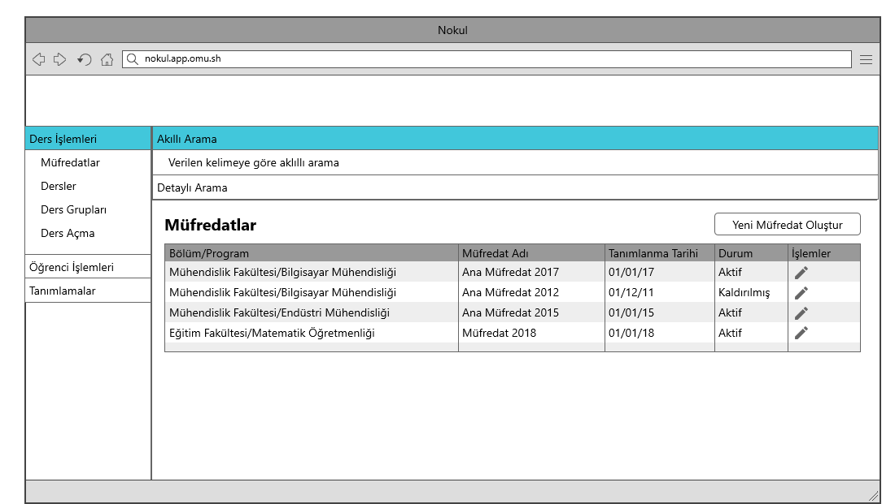
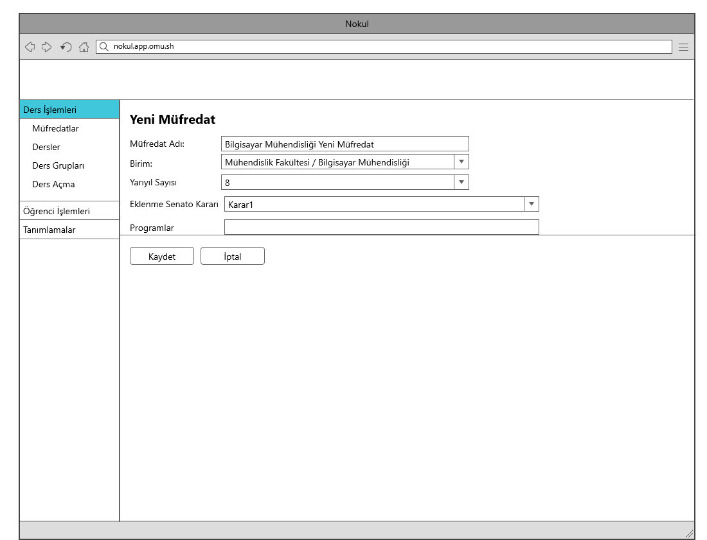

Use Case: Yeni müfredat oluştur
============

**Story:** Admin olarak, birimlerle ilişkili olarak müfredat tanımı eklemek istiyorum.

**Actor:** Admin

**Preconditions:**

- Birimler tanımlanmış olmalı
- Programlar tanımlanmış olmalı
- Tanımlı programlar arasında hazırlık programları belirtilmiş olmalı
- Senotaya ait kurul/komisyon kararlarına erişilebilir olmalı

| Actor        | System       |
| :----------- |:-------------|
| Kullanıcı, “Yeni Müfredat Oluştur” butonuna tıklar.| Sistem, kullanıcıya “Müfredat Ekle Formu” görüntüler.|
| Kullanıcı, formu doldurur ve “Kaydet” butonuna tıklar.| Sistem, formdaki zorunlu alanları kontrol ederek ilgili kaydı gerçekleştirir. |
| | Sistem kayıtlı müfredatları listeleme ekranına döner.|

**Not:** Yeni Müfredat Oluştur Formunda bulunması gereken alanlar:

| Field | Type | Required | Note |
| :---: | :---: | :---: | :---: |
| Müfredat Adı | Text | True | |
| Birim | Select | True | |
| Program | Multi Select | True | |
| Yarıyıl Sayısı | Int | True | |
| Senato Kararı | Select | True | |