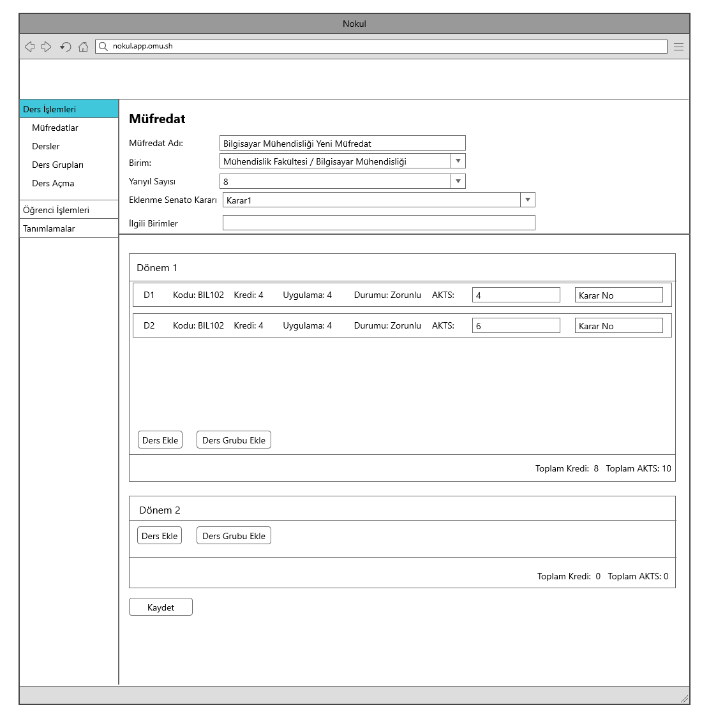

Use Case: Müfredata ders veya ders grubu ekle
============

**Story:** Admin olarak daha önce oluşturmuş olduğum müfredata ders veya ders grubu eklemek istiyorum.

**Actor:** Admin

**Preconditions:**

- Birimler tanımlanmış olmalı
- Programlar tanımlanmış olmalı
- Tanımlı programlar arasında hazırlık programları belirtilmiş olmalı
- Senotaya ait kurul/komisyon kararlarına erişilebilir olmalı
- Daha önceden tanımlanmış en az 1 müfredat olmalı

| Actor        | System       |
| :----------- |:-------------|
| Kullanıcı ders veya ders grubu eklemek istediği müfredatı seçer.| Sistem, kullanıcıya ilgili müfredata ait yarıyılları gösterir.|
| Kullanıcı ders eklemek istediği yarıyıla gelerek “Ders Ekle” butonuna tıklar.| Sistem kullanıcıya, seçim yapılabilecek dersleri listeler. Müfredatın bağlı olduğu birimin dersleri veya bu birimle paylaşılmış dersler burada listelenir.|
| Kullanıcı müfredata eklemek istediği dersleri seçer ve "Seçilenleri Ekle" butonuna tıklar. | Sistem seçilen dersleri ilgili dönem listesinde görüntüler. |
| Kullanıcı ders veya ders grubu eklemek istediği yarıyıla gelerek “Ders Grubu Ekle” seçimini yapar.| Sistem kullanıcıya, seçim yapılabilecek ders gruplarını listeler. Müfredatın bağlı olduğu birimin ders grupları veya bu birimle paylaşılmış ders grupları burada listelenir.|
| Kullanıcı müfredata eklemek istediği ders gruplarını seçer ve "Seçilenleri Ekle" butonuna tıklar. | Sistem seçilen ders gruplarını ilgili dönem listesinde görüntüler. |
| Kullanıcı seçtiği dersler ve ders grupları için AKTS değerlerini girer ve "Kaydet" butonuna tıklar | Sistem, her yıl toplam AKTS değerinin 60 olup olmadığını kontrol eder.   Her yıl (iki dönem toplamı) 60 AKTS ise sistem kayıt işlemi gerçekleştirir. Aksi halde kayıt işlemi gerçekleşmez. |

